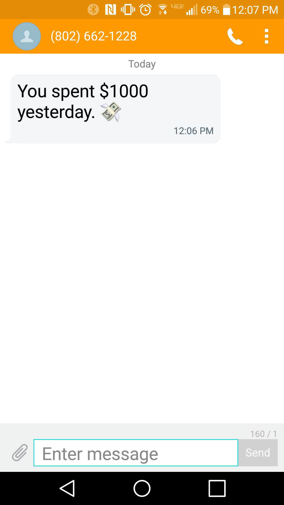

# Daily SMS Spending Summaries With Plaid and Twilio

Your bank lets you set up SMS alerts for various triggers; it might even give you the option of receiving periodic spending summaries (mine doesn't!).
But what about a daily SMS summary of your spending across *all* your accounts?  This is harder to come by, so let's roll our own:

## Pre-work


1. <a href="https://dashboard.plaid.com/signup" target="_blank">Nab a sandbox account</a> from Plaid, and put those credentials into `PLAID_CLIENT_ID`, `PLAID_SECRET`, `PLAID_PUBLIC_KEY` environment variables.  While you're at it, 
<a href="https://dashboard.plaid.com/overview/request-development" target="_blank">ask for access</a> the development API (it'll take a few days).  For now, though, create an env var `PLAID_ENV` and set it to 'sandbox'.

```bash
export PLAID_CLIENT_ID='somechars1234'
export PLAID_PUBLIC_KEY='somemorechars1234'
export PLAID_SECRET='somesecretchars1234'
export PLAID_ENV='sandbox'
```

2. Clone the <a href="https://github.com/plaid/quickstart" target="_blank">quickstart for Plaid</a> and reference those environment variables in the Python quickstart's `server.py`.

```python
PLAID_CLIENT_ID = os.getenv('PLAID_CLIENT_ID')
PLAID_SECRET = os.getenv('PLAID_SECRET')
PLAID_PUBLIC_KEY = os.getenv('PLAID_PUBLIC_KEY')
PLAID_ENV = os.getenv('PLAID_ENV')
```

3. Run `server.py` (Python 2 only 😦) and log into Chase with the test credentials ("user_good" and "pass_good" as of 5/24/2017). It prints the access token to your terminal: Grab that and put it into a `CHASE_ACCESS_TOKEN` environment variable.  Repeat this for Bank of America and put that access token into `BOFA_ACCESS_TOKEN`.

4. <a href="https://www.twilio.com/console/account/settings" target="_blank">Grab your Twilio credentials</a> and <a href="https://www.twilio.com/console/phone-numbers/incoming" target="_blank">Twilio incoming phone number</a> and make sure those are available as environment variables too (see below).

5. Put your cell phone number in an environment variable as `MY_CELL`.

```bash
export CHASE_ACCESS_TOKEN='access-sandbox-someprettysecretchars1234'
export BOFA_ACCESS_TOKEN='access-sandbox-somemoreprettysecretchars1234'
export TWILIO_SID='somechars1234'
export TWILIO_TOKEN='somesecretchars1234'
export MY_TWILIO_NUM='+11111111111'
export MY_CELL='+12222222222'
```

6. Install just a couple of dependencies:

```bash
$ pip install python-plaid twilio
```

## Get Some Transactions

Make yourself a `plaid.Client` instance and grab some transactions from Chase:

<a href="https://github.com/zevaverbach/spending_summary/blob/master/get_some_transactions_v1.py" target="_blank">get_some_transactions_v1.py</a>
```python
import os
from typing import List

# twilio.rest has a Client too, so let's avoid a namespace collision
from plaid import Client as PlaidClient

plaid_client = PlaidClient(client_id=os.getenv('PLAID_CLIENT_ID'), secret=os.getenv('PLAID_SECRET'),
                           public_key=os.getenv('PLAID_PUBLIC_KEY'), environment=os.getenv('PLAID_ENV'))


def get_some_transactions(access_token: str, start_date: str, end_date: str) -> List[dict]:
    return plaid_client.Transactions.get(access_token, start_date, end_date)
                                         
```


Inspecting the output of `get_some_transactions`, we see that there are multiple accounts, 337 transactions among them, but only 100 transactions returned from this API call.  Two of these accounts are for savings, so presumably they're only going to have transfers rather than purchases:

```python
>>> from get_some_transactions_v1 import get_some_transactions
>>> import os
>>> some_transactions = get_some_transactions(os.getenv('CHASE_ACCESS_TOKEN'), '1972-01-01', '2017-05-26'))
>>> some_transactions['total_transactions']
337
>>> from pprint import pprint
>>> pprint(some_transactions['accounts'])
[{'account_id': 'qwp96Z11b5IBKVMl8XvLSkJXjgj6ZxIXX3o79',
  'name': 'Plaid Checking',
  'subtype': 'checking'
  ...},
 {'account_id': 'Kk9ZL7NN4wSX3lR9evV8f9P4GVGk3BF33QnAM',
  'name': 'Plaid Saving',
  'subtype': 'savings'
  ...},
 {'account_id': 'rEy96MWWgXukrnBW4yVphv7yl3lznosBBzo6n',
  'name': 'Plaid CD',
  'subtype': 'cd'
  ...}
 {'account_id': '9rNKomMMdWTvVL4X9RP6UKb4qEqng1uJJ6nQw',
  'name': 'Plaid Credit Card',
  'subtype': 'credit'
  ...}]
>>> len(some_transactions['transactions'])
100
```
## Get **The Right** Transactions

Looking at the transactions themselves, we see that there is a `category` field which sometimes has a list of values, sometimes `None`.  What are the categories?

```python
>>> some_transactions['transactions'].keys()
dict_keys(['account_id', 'account_owner', 'amount', 'category', 'category_id', 'date', 'location', 'name', 'payment_meta', 'pending', 'pending_transaction_id', 'transaction_id', 'transaction_type'])
>>> {category for transaction in some_transactions['transactions'] if some_transactions['category'] for category in trans['category']} 
{'Airlines and Aviation Services',
 'Coffee Shop',
 'Credit Card',
 'Deposit',
 'Fast Food',
 'Food and Drink',
 'Payment',
 'Restaurants',
 'Transfer',
 'Travel'}
```


Among the categories there are "Transfer", "Credit Card", and "Deposit": These aren't going to be useful in gleaning spending activity, so we'll refactor our `get_some_transactions` function to 
1. skip transactions with those categories.
2. skip accounts with a subtype of "savings" or "cd".  

Let's also 

3. make sure to get all available transactions by using pagination.
4. just return transactions.


<a href="https://github.com/zevaverbach/spending_summary/blob/master/get_some_transactions_v2.py" target="_blank">get_some_transactions_v2.py</a>

```python
import math
...
# https://plaid.com/docs/api/#transactions
MAX_TRANSACTIONS_PER_PAGE = 500
OMIT_CATEGORIES = ["Transfer", "Credit Card", "Deposit"]


def get_some_transactions(access_token: str, start_date: str, end_date: str) -> List[dict]:
    account_ids = [account['account_id'] for account in plaid_client.Accounts.get(access_token)['accounts']
                   if account['subtype'] not in ['cd', 'savings']]
    
    num_available_transactions = plaid_client.Transactions.get(access_token, start_date, end_date,
                                                               account_ids=account_ids)['total_transactions']
    num_pages = math.ceil(num_available_transactions / MAX_TRANSACTIONS_PER_PAGE)
    transactions = []

    for page_num in range(num_pages):
        transactions += [transaction
                         for transaction in plaid_client.Transactions.get(access_token, start_date, end_date,
                                                                          account_ids=account_ids,
                                                                          offset=page_num * MAX_TRANSACTIONS_PER_PAGE,
                                                                          count=MAX_TRANSACTIONS_PER_PAGE)['transactions']
                         if transaction['category'] is None
                         or not any(category in OMIT_CATEGORIES
                                    for category in transaction['category'])]

    return transactions
```

Now there are just 265 transactions.  Are any of them negative?

```python
>>> len(some_transactions)
265
>>> pprint([transaction for transaction in some_transactions if transaction['amount'] < 0])
[{'amount': -500,
  'category': ['Travel', 'Airlines and Aviation Services'],
  'name': 'United Airlines',
  'transaction_type': 'special',
  ...},
  ...]
```

Okay, that seems legit -- airfare refund, I guess.  Let's keep negative items in.

## Pulling it All Together

Now let's get all the transactions from yesterday, making sure to pull them from both accounts.

<a href="https://github.com/zevaverbach/spending_summary/blob/master/get_yesterdays.py" target="_blank">get_yesterdays.py</a>

```python
...
def get_yesterdays_transactions() -> List[dict]:
    yesterday = ('2017-05-16' if os.getenv('PLAID_ENV') == 'sandbox'
                 else (datetime.date.today() - datetime.timedelta(days=1)).strftime('%Y-%m-%d'))

    transactions = []

    for access_id in [os.getenv('CHASE_ACCESS_TOKEN'), os.getenv('BOFA_ACCESS_TOKEN')]:
        transactions += get_transactions_from_multiple_accounts(access_id, yesterday, yesterday)
        
    return transactions
```

As of 5/24/2017, the most recent transactions available in these sandbox accounts are from 5/16/17: Hence, the hardcoded `yesterday` value above.

Let's send an SMS to ourselves with the total spent yesterday!

<a href="https://github.com/zevaverbach/spending_summary/blob/master/send_summary.py" target="_blank">get_send_summary.py</a>

```python
...
from twilio.rest import Client as TwilioClient

twilio_client = TwilioClient(os.getenv('TWILIO_SID'), os.getenv('TWILIO_TOKEN'))


def send_summary(transactions: List[dict]) -> None:
    total_spent = sum(transaction['amount'] for transaction in transactions)

    message = f'You spent ${total_spent} yesterday. 💸'

    twilio_client.api.account.messages.create(to=os.getenv('MY_CELL'), from_=os.getenv('MY_TWILIO_NUM'), body=message)
    

```
Voila!



